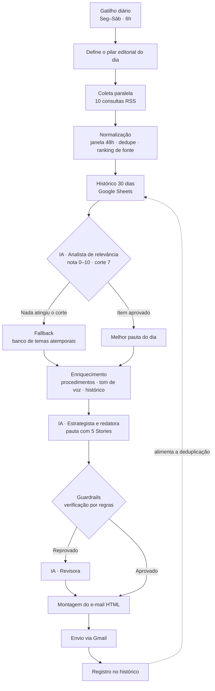

# Gerador de Conteúdo — Radar Inteligente para Instagram Stories

**Automação que lê as notícias do setor todo dia de manhã, avalia com IA o que realmente presta e entrega uma pauta de Stories pronta para gravar no e-mail da profissional — antes das 6h, sem custo de infraestrutura.**

`Google Apps Script` · `Gemini API` · `Google Sheets` · `Gmail API` · `RSS`

> Projeto em produção, construído para uma cliente real: uma biomédica esteta que precisava manter presença diária no Instagram sem tempo para pesquisar pauta entre atendimentos.

---

## Índice

1. [O problema](#1-o-problema)
2. [A ideia inicial](#2-a-ideia-inicial)
3. [Como o projeto está hoje](#3-como-o-projeto-está-hoje)
4. [Por que o projeto existe](#4-por-que-o-projeto-existe)
5. [Arquitetura](#5-arquitetura)
6. [Decisões de engenharia](#6-decisões-de-engenharia)
7. [Stack](#7-stack)
8. [Números](#8-números)
9. [Estrutura do repositório](#9-estrutura-do-repositório)
10. [Como instalar](#10-como-instalar)
11. [Trajetória e aprendizados](#11-trajetória-e-aprendizados)
12. [Próximos passos](#12-próximos-passos)
13. [Privacidade e dados](#13-privacidade-e-dados)

---

## 1. O problema

A cliente é biomédica com atuação em estética e análises clínicas. O Instagram é o principal canal de aquisição de pacientes, mas manter conteúdo diário competia com a agenda de atendimentos.

| Dor | Consequência |
|---|---|
| Sem tempo para pesquisar tendências entre atendimentos | Conteúdo irregular ou inexistente |
| Bloqueio criativo diário ("o que eu posto hoje?") | Postagens genéricas, sem estratégia |
| Conteúdo desconectado de um plano editorial | Audiência não avança até o agendamento |
| Risco de reproduzir modismo sem evidência | Exposição profissional e perda de autoridade |
| Nenhum registro do que já foi publicado | Repetição de temas e desgaste da audiência |

O custo não é só tempo. Em saúde, um conteúdo mal formulado — uma promessa de resultado, uma indicação individualizada, um dado inventado — é **risco profissional**. Qualquer automação nesse contexto precisa ser desenhada com isso no centro.

---

## 2. A ideia inicial

O projeto nasceu de um briefing fechado com a profissional em **agosto de 2026**. A definição mais importante estava logo na primeira página:

> O entregável diário **não é um resumo de notícias**. É uma sugestão de conteúdo pronta para gravar, com tema, objetivo, sequência de 5 Stories, interação e CTA.

**Meta prática:** reduzir a decisão de "o que postar hoje" a menos de 5 minutos.

O desenho original previa:

```
Gatilho diário → Coleta RSS → IA filtra relevância → IA escreve a pauta
→ Validação por regras → E-mail → Registro no histórico
```

Com quatro premissas que sobreviveram a todas as reescritas:

- **Humano no circuito.** Nada é publicado automaticamente. A profissional é sempre a aprovadora final.
- **Qualidade acima de quantidade.** Uma pauta por dia. O sistema prefere dizer "hoje não houve novidade relevante" a forçar conteúdo fraco.
- **Memória externa obrigatória.** Sem histórico persistido, não há como cumprir a regra de não repetir tema.
- **Segurança editorial por padrão.** A checagem das regras não pode depender só do prompt.

A stack prevista era **n8n + LLM + e-mail**, com Google Sheets como base de contexto.

---

## 3. Como o projeto está hoje

Em produção, rodando de **segunda a sábado às 6h** (domingo não há envio, por decisão editorial).

O que mudou em relação ao desenho inicial — e por quê:

| Ideia inicial | Hoje | Motivo da mudança |
|---|---|---|
| n8n Cloud (plataforma de automação) | **Google Apps Script** | O trial do n8n acabou. Ao reavaliar, ficou claro que o Radar é um script agendado linear: a plataforma visual era andaime, não valor. Migrar eliminou assinatura e limite de operações |
| 5 consultas RSS | **10 consultas segmentadas** | Ampliação para suplementação, ganho de massa muscular, saúde capilar e o cruzamento "canetas emagrecedoras × queda de cabelo" |
| 2 chamadas de IA | **3 chamadas com papéis distintos** | Analista, redatora e — quando os guardrails reprovam — revisora |
| Nenhum ranking de fonte | **Classificação de credibilidade** | Veículos reconhecidos ganham prioridade nas vagas enviadas à IA |
| Modelo de IA fixo no código | **Autocorreção de modelo** | Modelos são aposentados sem aviso; o sistema descobre sozinho um substituto |
| Falha silenciosa | **Alerta por e-mail com diagnóstico** | Três execuções falharam sem ninguém perceber. Ver [LOG.md](LOG.md) |

**Custo de operação: R$ 0.** Sem servidor, sem assinatura, sem limite de execuções.

---

## 4. Por que o projeto existe

**Motivo prático.** Resolver um gargalo real de uma profissional que perde oportunidade de agendamento por inconsistência de conteúdo.

**Motivo técnico.** Exercitar, de ponta a ponta, o que separa um protótipo com LLM de um sistema que roda sozinho todo dia: tratamento de falha, limites de API, memória, fallback, observabilidade e portabilidade entre plataformas.

**A tese central do projeto:** usar IA para gerar conteúdo em área de saúde é fácil de demonstrar e difícil de operar com segurança. O valor não está na chamada ao modelo — está nas **travas em volta dela**. Por isso o sistema:

- valida a saída do modelo com **regras determinísticas**, não com outro prompt;
- só permite citar procedimentos que a clínica realmente realiza;
- bloqueia promessa de resultado por lista de termos;
- sinaliza explicitamente o que exige conferência técnica antes de publicar;
- prefere não sugerir nada a sugerir algo fraco.

---

## 5. Arquitetura



### Calendário editorial

Cada dia da semana tem um pilar fixo, e a IA precisa encaixar a pauta nele:

| Dia | Pilar | Direcionamento |
|---|---|---|
| Segunda | Humanização | Bastidores, rotina, proximidade |
| Terça | Dor da paciente | Situações comuns, dúvidas, identificação |
| Quarta | Caso clínico | Processo, procedimento, jornada |
| Quinta | Educação | Explicações, mitos e verdades |
| Sexta | Engajamento | Enquetes, quizzes, perguntas |
| Sábado | Prova social e conversão | Resultados autorizados, agenda |
| Domingo | — | Sem envio |

### Estrutura fixa da pauta

| Story | Função |
|---|---|
| 1 — Gancho | Parar o dedo: pergunta, dado ou situação de identificação |
| 2 — Contexto | Explicar a novidade ou a dor em linguagem de paciente |
| 3 — Desenvolvimento | Entregar valor: explicação, mito × verdade, bastidor |
| 4 — Aplicação prática | Como afeta a rotina, a pele ou a decisão da paciente |
| 5 — Fechamento | Recado final e CTA único |

---

## 6. Decisões de engenharia

As escolhas que mais definiram o resultado:

**1. Duas camadas de IA com papéis distintos.** Separar o filtro da geração melhora a qualidade e barateia: das ~300 notícias coletadas, só a vencedora passa pela chamada cara de redação.

**2. Guardrails determinísticos depois da IA.** O modelo não é a última palavra. Um verificador em JavaScript checa termos proibidos, procedimento fora do escopo e estrutura de 5 Stories. Reprovou, volta para a IA corrigir uma vez — e o e-mail avisa que houve correção.

**3. Fallback explícito.** Se nada atinge a nota de corte, entra um banco de 18 temas atemporais por pilar, e o e-mail deixa claro que é fallback. O sistema pode dizer "hoje não" sem quebrar a rotina.

**4. Memória externa.** Toda pauta enviada vira linha no histórico. A janela de 30 dias alimenta tanto o corte antirrepetição quanto o prompt da IA.

**5. Ranking de credibilidade da fonte.** Veículos reconhecidos ocupam até 10 das 15 vagas enviadas à IA, e o prompt instrui preferência em caso de empate. O matching é por igualdade ou prefixo delimitado — comparação por substring gerava falso positivo (ver [LOG.md](LOG.md)).

**6. Autocorreção de modelo de IA.** Quando os modelos configurados são aposentados, o script lê na mensagem de erro qual o Google recomenda, testa os candidatos disponíveis, grava o que funcionar e segue usando. Nasceu de uma quebra real em produção.

**7. Observabilidade mínima.** Qualquer falha dispara um e-mail que identifica a causa provável e diz o que fazer. Existe porque três execuções falharam em silêncio por três dias.

**8. Chave de API fora do código.** A credencial do Gemini vive nas *Script Properties*, não no fonte.

---

## 7. Stack

| Componente | Tecnologia | Por que |
|---|---|---|
| Agendamento | Acionador por tempo do Apps Script | Nativo, gratuito, sem servidor |
| Coleta | `UrlFetchApp.fetchAll` + `XmlService` | Busca os 10 feeds em paralelo |
| Fontes | Google News RSS (consultas segmentadas) | Cobertura ampla em português, sem API key |
| Inteligência | Gemini API (`generateContent`) | Saída forçada em JSON via `responseMimeType` |
| Banco de dados | Google Sheets (3 abas) | Editável pela própria cliente, sem infraestrutura |
| Entrega | `GmailApp` | Sem OAuth adicional: roda na conta que envia |
| Segurança editorial | JavaScript determinístico | Não delega a validação ao modelo |

---

## 8. Números

| Métrica | Valor |
|---|---|
| Notícias coletadas por execução | ~300 |
| Candidatos enviados à IA após dedupe | 15 |
| Pautas entregues por dia | 1 |
| Chamadas de IA por execução | 2 a 3 |
| Tempo de execução | ~40 s (limite de 6 min) |
| Envios por mês | ~26 |
| Custo mensal de operação | R$ 0 |

### Critérios de sucesso definidos no briefing

1. E-mail entregue em pelo menos 95% dos dias programados.
2. Ao menos 4 de 6 pautas semanais consideradas aproveitáveis.
3. Zero ocorrências de dado inventado, promessa de resultado ou orientação clínica indevida.
4. Nenhum tema repetido dentro de 30 dias.

---

## 9. Estrutura do repositório

```
.
├── README.md                              # Este documento
├── LOG.md                                 # Diário de engenharia: erros, acertos e decisões
├── apps-script/                           # ★ Implementação em produção
│   ├── Codigo.gs                          # Sistema completo
│   ├── Prompts.gs                         # Os três prompts calibrados
│   ├── PASSO-A-PASSO.md                   # Guia de instalação detalhado
│   └── INSTALACAO.md                      # Resumo da instalação
├── docs/                                  # Insumos da cliente e estudos
│   ├── briefing.md                        # Especificação original aprovada
│   ├── procedimentos-clinica.txt          # Catálogo de procedimentos da clínica
│   ├── solicitacao-novos-segmentos.txt    # Pedido de ampliação das buscas
│   └── migracao-make.md                   # Estudo de alternativa (Make) — não adotado
└── backup/                                # Lógica preservada da versão n8n
    ├── LOGICA-COMPLETA.md                 # Toda a lógica, independente de plataforma
    └── dados/
        ├── radar_evergreen.csv            # 18 temas de fallback
        └── radar_base_clinica.csv         # 32 registros de contexto da clínica
```

---

## 10. Como instalar

O guia completo, etapa por etapa, está em **[apps-script/PASSO-A-PASSO.md](apps-script/PASSO-A-PASSO.md)** — com o que fazer, o que esperar em cada tela e o diagnóstico de cada erro possível.

Resumo em cinco passos:

1. Criar uma planilha no Google Sheets e copiar o ID da URL
2. Criar um projeto em [script.google.com](https://script.google.com) e colar `Codigo.gs` e `Prompts.gs`
3. Preencher `PLANILHA_ID` e os e-mails no bloco `CONFIG`; guardar a chave do Gemini nas *Propriedades do script*
4. Rodar `prepararPlanilha()` e importar os dois CSVs de `backup/dados/`
5. Rodar `verificarInstalacao()`, `testarAgora()` e, por fim, `instalarAcionador()`

### Funções de diagnóstico

| Função | Para que serve |
|---|---|
| `verificarInstalacao()` | Confere configuração, planilha e acesso à IA |
| `testarAgora()` | Roda o fluxo inteiro sem enviar e-mail nem gravar histórico |
| `testarModelos()` | Testa de verdade cada modelo de IA disponível |
| `listarModelosDisponiveis()` | Lista os modelos da API em cada versão |
| `esquecerModeloDescoberto()` | Limpa o modelo gravado pela autocorreção |

---

## 11. Trajetória e aprendizados

O projeto passou por duas migrações de plataforma, três trocas de provedor de IA e nove falhas documentadas — cada uma com causa raiz, correção e lição.

Está tudo registrado em **[LOG.md](LOG.md)**, incluindo os erros que quebraram a produção: estouro de limite de tokens, credencial inválida, falhas silenciosas por três dias e modelo de IA aposentado sem aviso.

Os três aprendizados que mais mudaram o sistema:

- **Payload de IA é superfície de falha.** Enviar o objeto inteiro em vez do mínimo necessário estourou o limite de tokens e derrubou três envios.
- **Listagem oficial não é contrato.** A API do Google lista modelos que ela mesma recusa. A única prova de disponibilidade é uma chamada real.
- **Sistema que falha calado é sistema que não existe.** Sem alerta, a quebra só apareceu quando alguém sentiu falta do e-mail.

---

## 12. Próximos passos

**Curto prazo**
- Botão de feedback no próprio e-mail, gravando direto no histórico
- Duas ou três opções de pauta por dia, para escolha
- Envio paralelo por WhatsApp

**Médio prazo**
- Geração das artes de fundo dos Stories
- Banco de conteúdo pesquisável com tudo que já foi sugerido
- Inclusão de bases científicas com camada de simplificação

**Longo prazo**
- Leitura das métricas reais do Instagram para retroalimentar a curadoria
- Expansão para Reels e carrosséis

---

## 13. Privacidade e dados

- A chave da API do Gemini **não está no repositório** — fica nas *Script Properties* do projeto Apps Script.
- Os dados de contexto da clínica (`backup/dados/`) contêm catálogo de procedimentos e tom de voz, material de natureza comercial, publicado com autorização.
- O histórico de pautas enviadas fica na planilha privada da cliente e não é versionado aqui.
- Nenhum dado de paciente é coletado, processado ou armazenado pelo sistema.
