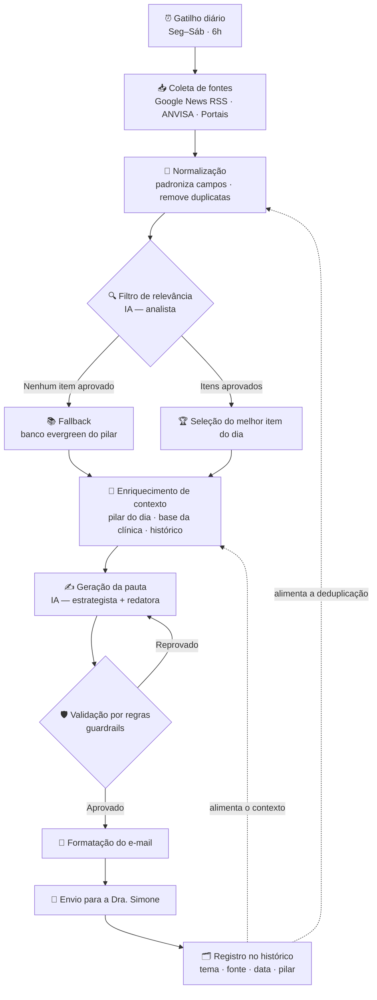

# Briefing — Radar Inteligente de Conteúdo para Instagram Stories

**Cliente:** Dra. Simone Paes — Biomédica (Estética e Análises Clínicas)
**Produto:** Automação diária de curadoria e geração de pautas para Stories
**Stack:** N8N + LLM + envio por e-mail
**Status:** Briefing para construção posterior (não contém workflow, código ou JSON)
**Data:** 09/08/2026

---

## 1. Objetivo do projeto

Criar uma automação que, todas as manhãs, busque novidades relevantes do universo da estética, analise essas informações com IA e entregue à Dra. Simone, por e-mail, **uma pauta pronta de Stories** alinhada ao pilar de conteúdo do dia.

O entregável diário não é um resumo de notícias: é uma **sugestão de conteúdo pronta para gravar**, com tema, objetivo, sequência de 5 Stories, interação e CTA.

**Meta prática:** reduzir a decisão diária de "o que postar hoje" a menos de 5 minutos, mantendo consistência editorial e segurança técnica/ética.

---

## 2. Problema que resolve

| Problema atual | Impacto |
|---|---|
| Falta de tempo para pesquisar tendências entre atendimentos | Conteúdo irregular ou inexistente |
| Bloqueio criativo diário ("o que eu posto hoje?") | Postagens genéricas, sem estratégia |
| Conteúdo desconectado de um plano editorial | Audiência não avança na jornada até o agendamento |
| Risco de reproduzir modismos sem evidência | Exposição profissional e perda de autoridade |
| Ausência de memória do que já foi publicado | Repetição de temas e desgaste da audiência |

---

## 3. Funcionamento

**Fluxo macro:**

```
N8N (gatilho diário) → Busca de informações → IA analisa → Filtra →
Identifica oportunidade → Gera Stories → Envia por e-mail
```

**Detalhamento operacional:**

1. **Gatilho:** agendamento diário, de segunda a sábado, às 6h (horário de Brasília). Domingo sem envio.
2. **Coleta:** o N8N consulta as fontes configuradas e recolhe os itens das últimas 24–48h.
3. **Normalização:** padroniza título, resumo, link, fonte e data; remove duplicatas e itens já usados (consulta ao histórico).
4. **Filtro de relevância (IA):** cada item recebe uma nota de relevância para a audiência da Dra. Simone. Itens abaixo do corte são descartados.
5. **Seleção:** escolhe o melhor item do dia (1 principal). Qualidade acima de quantidade.
6. **Enriquecimento de contexto:** injeta o pilar do dia, a lista de procedimentos da clínica, o tom de voz e o histórico recente de temas.
7. **Geração:** a IA produz a pauta completa (oportunidade + sequência de Stories + interação + CTA).
8. **Validação por regras:** checagem automática contra a lista de restrições (sem promessa de resultado, sem diagnóstico, sem dado inventado).
9. **Entrega:** e-mail formatado para a Dra. Simone.
10. **Registro:** o tema é gravado no histórico para evitar repetição e permitir análise futura.

**Regra de fallback:** se nenhum item da coleta atingir o corte de relevância, o sistema **não força uma pauta ruim**. Ele usa o banco interno de temas atemporais (evergreen) do pilar do dia e sinaliza isso no e-mail ("Sem novidade relevante hoje — sugestão a partir do banco interno").

---

## 4. Fontes de informação

### Recomendadas para o MVP (começar com estas)

| Fonte | Tipo | Por que entra no MVP |
|---|---|---|
| **Google News (RSS por consulta)** | Agregador | Cobertura ampla em português, sem custo, sem API key. Consultas segmentadas por tema (ex.: harmonização facial, skinbooster, bioestimulador, protocolo facial, saúde da pele). |
| **ANVISA — notícias/alertas** | Órgão regulador | Autoridade máxima em segurança de produtos e procedimentos. Alta credibilidade e gera conteúdo educativo de alto valor. |
| **Portais especializados do setor com RSS** | Imprensa técnica | Tendências e lançamentos antes da mídia geral. Selecionar de 2 a 3 veículos com a Dra. Simone. |
| **Base interna da clínica** | Contexto proprietário | Não é fonte de notícia, é fonte de **contexto**: procedimentos oferecidos, dúvidas frequentes das pacientes, casos autorizados, promoções e agenda. Sem ela a IA gera conteúdo genérico. |

### Deixar para a fase 2

- **PubMed / bases científicas (RSS):** ótimo para autoridade, mas exige camada extra de tradução e simplificação, além de curadoria mais rigorosa.
- **Sociedades e conselhos profissionais:** incluir conforme disponibilidade de feed estruturado.
- **Tendências de redes sociais (Instagram/TikTok/Google Trends):** alto valor editorial, porém dependem de integrações menos estáveis.

### Estrutura mínima da base interna (a preencher com a Dra. Simone)

- Lista de procedimentos realizados, com descrição em linguagem de paciente.
- Procedimentos **não** realizados (para a IA nunca sugerir).
- Top 20 dúvidas e objeções mais ouvidas no consultório.
- Casos com autorização de uso de imagem já assinada.
- Tom de voz, termos preferidos e termos proibidos.
- Banco de temas evergreen por pilar (para o fallback).

---

## 5. Papel da IA

A IA atua em **três etapas distintas**, não em uma só.

### 5.1 Analista de relevância (filtro)
Avalia cada item coletado e responde:
- Isso interessa a uma paciente real de estética, ou é notícia de mercado/corporativa?
- Tem base confiável ou é modismo sem evidência?
- Dá para transformar em conteúdo dentro da atuação da Dra. Simone?
- Já foi abordado recentemente?

Saída: nota de relevância + justificativa + decisão (aprovar/descartar).

### 5.2 Estrategista de conteúdo
Sobre o item aprovado, define:
- **Tema** — o ângulo editorial, não o título da notícia.
- **Pilar do dia** — encaixe obrigatório no calendário.
- **Objetivo** — educar, gerar identificação, aproximar, engajar ou converter.
- **Formato** — explicação, mito x verdade, bastidor, enquete, comparativo, depoimento.
- **Procedimento relacionado** — apenas entre os que a clínica realiza; se não houver, declarar "nenhum".
- **Necessidade de validação profissional** — sim/não, com o ponto exato a validar.

### 5.3 Redatora de Stories
Transforma a estratégia em roteiro pronto para gravação: 5 Stories encadeados, com texto de tela, orientação de fala, interação e CTA.

### Restrições obrigatórias (aplicadas nas três etapas)

A IA **deve**:
- Priorizar fontes confiáveis e citar sempre origem e link.
- Trabalhar apenas com o que está na fonte; nunca completar lacunas com suposição.
- Sinalizar explicitamente o que precisa de validação profissional.
- Respeitar os limites de atuação da biomedicina estética.
- Consultar o histórico e evitar repetição de temas.
- Preferir não sugerir nada a sugerir algo fraco.

A IA **não deve**:
- Inventar dados, estudos, números, casos ou resultados.
- Prometer ou insinuar resultado ("garante", "elimina", "acaba com", "resultado imediato").
- Fazer diagnóstico, prescrição ou indicação individualizada.
- Sugerir procedimentos fora do escopo da clínica.
- Usar linguagem sensacionalista ou alarmista.
- Comparar-se a outros profissionais ou citar concorrentes.

> **Ponto a validar com a Dra. Simone:** as regras de publicidade em saúde do Conselho Federal de Biomedicina (uso de antes/depois, depoimentos, divulgação de valores) devem ser levantadas junto à profissional e convertidas em restrições explícitas do prompt antes do go-live. Este briefing assume que essa lista será fornecida por ela.

---

## 6. Estrutura dos Stories

Sequência fixa de 5 Stories, com função definida para cada um:

| Story | Função | Conteúdo |
|---|---|---|
| **1 — Gancho** | Parar o dedo | Pergunta, dado da notícia ou situação de identificação. Sem tecnicismo. |
| **2 — Contexto** | Explicar o "o quê" | A novidade ou a dor, em linguagem de paciente. |
| **3 — Desenvolvimento** | Entregar valor | Explicação, mito x verdade, bastidor ou processo. É aqui que a autoridade aparece. |
| **4 — Aplicação prática** | Conectar à realidade dela | Como isso afeta a rotina, a pele ou a decisão da paciente. Vínculo com o procedimento, quando houver. |
| **5 — Fechamento** | Direcionar | Recado final + CTA. |

Complementos obrigatórios da pauta:
- **Interação sugerida:** enquete, caixinha de perguntas, quiz, controle deslizante ou "responda aqui".
- **CTA:** ação única e clara (mandar DM, clicar no link, responder a caixinha, agendar avaliação).
- **Observações de gravação:** sugestão de cenário/apoio visual, quando fizer sentido.
- **Flag de validação:** marcação visível quando algum ponto exigir conferência técnica antes de publicar.

### Calendário editorial (pilar por dia)

| Dia | Pilar | Direcionamento |
|---|---|---|
| Segunda | **Humanização** | Bastidores, rotina, preparação, proximidade |
| Terça | **Dor da paciente** | Situações comuns, dúvidas, incômodos, identificação |
| Quarta | **Caso clínico** | Casos autorizados, processo, procedimento, resultado |
| Quinta | **Educação** | Explicações, procedimentos, mitos e verdades |
| Sexta | **Engajamento** | Enquetes, quizzes, perguntas, interação |
| Sábado | **Prova social + conversão** | Resultados autorizados, depoimentos, bastidores, agenda |
| Domingo | — | Sem envio |

> Quarta e sábado dependem de material autorizado. Quando não houver caso liberado no banco interno, a IA deve trabalhar o pilar em formato de **processo/jornada** (como é a avaliação, o que acontece na sessão), sem inventar caso e sem usar imagem não autorizada.

---

## 7. Estrutura do e-mail

**Assunto:** `Radar do dia — [pilar do dia] — [data]`
**Destinatário:** Dra. Simone Paes
**Frequência:** segunda a sábado, pela manhã

### Corpo

**📡 Radar do dia**
- Principal novidade encontrada
- Fonte e link
- Resumo curto (2 a 3 linhas)
- Por que é relevante para a audiência

**💡 Oportunidade de conteúdo**
- Tema
- Pilar do dia
- Objetivo
- Procedimento relacionado (ou "nenhum")

**🎬 Sequência de Stories**
- Story 1 · Story 2 · Story 3 · Story 4 · Story 5
- Interação sugerida
- CTA

**⚠️ Observações**
- Pontos que exigem validação profissional
- Aviso de fallback, quando aplicável
- Temas descartados no dia (lista curta, para transparência da curadoria)

**Diretrizes de formato:** e-mail em HTML simples, legível no celular, texto copiável e sem imagens pesadas. A leitura completa deve levar menos de 2 minutos.

---

## 8. MVP

### Escopo incluído

- Gatilho diário automático (seg–sáb, manhã).
- Google News (RSS) + ANVISA + 2 portais especializados.
- Base interna da clínica em planilha (Google Sheets) com procedimentos, dúvidas, tom de voz e temas evergreen.
- Filtro de relevância com IA (1 chamada) e geração de pauta com IA (1 chamada).
- Deduplicação e histórico de temas em planilha.
- Aplicação das regras de segurança e flags de validação.
- 1 sugestão principal por dia, entregue por e-mail.
- Fallback com banco de temas evergreen.

### Escopo excluído no MVP

- Publicação automática no Instagram.
- Geração de imagens, artes ou vídeos.
- Bases científicas (PubMed) e tradução de estudos.
- Painel/dashboard de desempenho.
- Múltiplas sugestões por dia ou aprovação interativa.
- Integração com WhatsApp, Telegram ou CRM.

### Critérios de sucesso do MVP

1. E-mail entregue em pelo menos 95% dos dias úteis programados.
2. Ao menos 4 de 6 pautas semanais consideradas aproveitáveis pela Dra. Simone.
3. Zero ocorrências de dado inventado, promessa de resultado ou orientação clínica indevida.
4. Nenhum tema repetido dentro de uma janela de 30 dias.

### Pré-requisitos de entrada

- Base interna preenchida pela Dra. Simone (item 4).
- Lista de restrições de publicidade validada por ela.
- Definição dos portais especializados de referência.
- E-mail de destino e credencial de envio.
- Acesso ao provedor de LLM.

**Fase de calibração:** as duas primeiras semanas devem ser tratadas como ajuste fino. A Dra. Simone marca cada pauta como "usei / adaptei / descartei", e esse retorno alimenta a revisão dos prompts.

---

## 9. Possíveis evoluções futuras

**Curto prazo**
- Botão de feedback no próprio e-mail (usei / adaptei / descartei) alimentando a planilha de histórico.
- Duas ou três opções de pauta por dia, para escolha.
- Envio paralelo por WhatsApp ou Telegram.

**Médio prazo**
- Geração das artes de fundo dos Stories.
- Roteiro em áudio ou teleprompter para gravação.
- Banco de conteúdo pesquisável, com tudo que já foi sugerido e publicado.
- Inclusão de bases científicas com camada de simplificação.
- Planejamento semanal antecipado, entregue aos domingos.

**Longo prazo**
- Publicação assistida com aprovação em um clique.
- Leitura das métricas reais do Instagram para retroalimentar a curadoria (aprender o que engaja de fato).
- Expansão para Reels, carrosséis e roteiros longos.
- Segmentação por linha de atuação (estética x análises clínicas).

---

## 10. Arquitetura conceitual do fluxo



### Camadas do sistema

| Camada | Responsabilidade | Onde vive |
|---|---|---|
| **Orquestração** | Agendamento, encadeamento, tratamento de erro e retry | N8N |
| **Coleta** | Leitura dos feeds e captura dos itens | N8N (nós de RSS/HTTP) |
| **Inteligência** | Filtro de relevância, estratégia e redação | LLM, via prompts separados por etapa |
| **Contexto** | Base da clínica, tom de voz, restrições, temas evergreen | Google Sheets |
| **Memória** | Histórico de temas sugeridos, para deduplicação e aprendizado | Google Sheets |
| **Entrega** | Montagem e envio do e-mail | N8N (nó de e-mail) |
| **Segurança editorial** | Guardrails, flags de validação, política de publicidade | Prompt + verificação por regras |

### Decisões de arquitetura

- **Duas chamadas de IA, não uma.** Separar o filtro da geração melhora a qualidade e barateia o processo: só o item vencedor passa pela chamada cara de redação.
- **Memória externa obrigatória.** Sem o histórico em planilha, não há como cumprir a regra de não repetir conteúdo.
- **Fallback explícito.** O sistema precisa poder dizer "hoje não houve novidade relevante" sem quebrar a rotina de publicação.
- **Humano no circuito.** Nenhuma publicação automática no MVP. A Dra. Simone é sempre a aprovadora final, e o e-mail é desenhado para isso.
- **Tratamento de falha.** Se uma fonte cair, o fluxo segue com as demais. Se todas falharem, dispara o fallback e registra o incidente.
